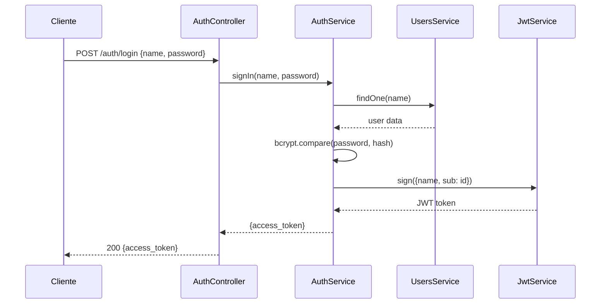
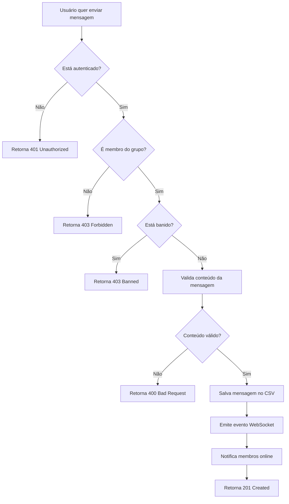
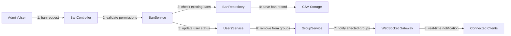

# 🎓 WHATSUT - SISTEMA DE COMUNICAÇÃO INTERPESSOAL
## Trabalho RMI - Sistemas Distribuídos - Ciência da Computação

---

## 📋 ÍNDICE
1. [Resumo Executivo](#-resumo-executivo)
2. [Arquitetura do Sistema](#-arquitetura-do-sistema)
3. [Requisitos Implementados](#-requisitos-implementados)
4. [Diagramas UML](#-diagramas-uml)
5. [Tecnologias Utilizadas](#-tecnologias-utilizadas)
6. [Estrutura de Pastas](#-estrutura-de-pastas)
7. [API Documentation](#-api-documentation)
8. [Segurança Implementada](#-segurança-implementada)
9. [Testes e Validações](#-testes-e-validações)
10. [Como Executar](#-como-executar)
11. [Demonstração de Funcionalidades](#-demonstração-de-funcionalidades)

---

## 🎯 RESUMO EXECUTIVO

O **WhatsUT** é um sistema completo de comunicação interpessoal desenvolvido com foco em **Sistemas Distribuídos**, implementando:

- ✅ **Arquitetura Modular** com separação de responsabilidades
- ✅ **Autenticação criptografada** com JWT e bcrypt
- ✅ **Chat privado e em grupos** com WebSocket
- ✅ **Sistema de upload de arquivos** seguro
- ✅ **Sistema de banimentos** e moderação
- ✅ **Interface moderna** com React + TypeScript
- ✅ **Documentação completa** com Swagger
- ✅ **Testes E2E abrangentes** (35 testes)

---

## 🏗️ ARQUITETURA DO SISTEMA

### **Padrão Arquitetural: Microserviços Modulares**

```
┌─────────────────────────────────────────────────────────────┐
│                    WHATSUT SYSTEM                           │
├─────────────────────────────────────────────────────────────┤
│  Frontend (React + TypeScript)                             │
│  ├── Componentes Reutilizáveis                             │
│  ├── Gerenciamento de Estado (Context API)                 │
│  ├── Comunicação WebSocket                                 │
│  └── Interface Responsiva (Tailwind CSS)                   │
├─────────────────────────────────────────────────────────────┤
│  Backend (NestJS + TypeScript)                             │
│  ├── Módulo de Autenticação (JWT + bcrypt)                 │
│  ├── Módulo de Usuários (CRUD + Validações)                │
│  ├── Módulo de Grupos (Permissões + Admin)                 │
│  ├── Módulo de Chat (Privado + Grupos)                     │
│  ├── Módulo de Banimentos (Moderação)                      │
│  ├── Gateway WebSocket (Tempo Real)                        │
│  └── Sistema de Upload (Arquivos)                          │
├─────────────────────────────────────────────────────────────┤
│  Persistência de Dados                                     │
│  ├── CSV Files (users.csv, groups.csv, chats.csv)          │
│  ├── File Storage (uploads/)                               │
│  └── In-Memory Cache (usuários online)                     │
├─────────────────────────────────────────────────────────────┤
│  Segurança e Validações                                    │
│  ├── Criptografia de Senhas (bcrypt)                       │
│  ├── Tokens JWT (autenticação)                             │
│  ├── Validações Anti-XSS                                   │
│  ├── Sanitização de Dados                                  │
│  └── Guards e Interceptors                                 │
└─────────────────────────────────────────────────────────────┘
```

### **Comunicação Entre Componentes**

1. **HTTP REST API** - Operações CRUD principais
2. **WebSocket** - Comunicação em tempo real
3. **JWT Tokens** - Autenticação stateless
4. **File Upload** - Multipart/form-data
5. **Event-Driven** - Callbacks e notificações

---

## ✅ REQUISITOS IMPLEMENTADOS

### 🔐 **1. Autenticação Criptografada**
- [x] **Registro de usuários** com senha forte obrigatória
- [x] **Login com JWT** (JSON Web Tokens)
- [x] **Criptografia bcrypt** para senhas (salt rounds: 10)
- [x] **Validação de token** em todas as rotas protegidas
- [x] **Logout seguro** com remoção de sessão

**Endpoints:**
```
POST /auth/register - Cadastro de usuário
POST /auth/login    - Autenticação
POST /auth/logout   - Logout
GET  /auth/profile  - Perfil do usuário
```

### 👥 **2. Lista de Usuários**
- [x] **Listagem completa** de usuários cadastrados
- [x] **Status online/offline** em tempo real
- [x] **Identificação visual** do usuário logado
- [x] **Informações de perfil** (nome, status, último acesso)

**Endpoints:**
```
GET    /users           - Listar usuários
GET    /users/:id       - Buscar usuário específico
PATCH  /users/profile   - Atualizar próprio perfil
DELETE /users/profile   - Excluir própria conta
```

### 🏢 **3. Sistema de Grupos**
- [x] **Criação de grupos** por qualquer usuário
- [x] **Lista de grupos** disponíveis
- [x] **Solicitação de entrada** com aprovação
- [x] **Gerenciamento de membros** pelo administrador
- [x] **Transferência de administração** automática
- [x] **Exclusão de grupos** pelo admin

**Endpoints:**
```
GET    /groups                      - Listar grupos
GET    /groups/my                   - Meus grupos
POST   /groups/create               - Criar grupo
PATCH  /groups/:id/join             - Solicitar entrada
PATCH  /groups/:id/approve/:userId  - Aprovar membro
PATCH  /groups/:id/reject/:userId   - Rejeitar membro
PATCH  /groups/:id/ban/:userId      - Banir membro
DELETE /groups/:id/leave            - Sair do grupo
PATCH  /groups/:id                  - Atualizar grupo
DELETE /groups/:id                  - Excluir grupo
```

### 💬 **4. Sistema de Chat Duplo**

#### **Chat Privado (1:1)**
- [x] **Mensagens privadas** entre dois usuários
- [x] **Histórico persistente** de conversas
- [x] **Notificações em tempo real** via WebSocket
- [x] **Validação de permissões** (apenas remetente/destinatário)

#### **Chat em Grupos**
- [x] **Mensagens para grupos** (múltiplos usuários)
- [x] **Controle de acesso** (apenas membros)
- [x] **Moderação automática** (banimentos)
- [x] **Notificações em grupo** via WebSocket

**Endpoints:**
```
GET  /chat/private/:userId   - Mensagens privadas
GET  /chat/group/:groupId    - Mensagens do grupo
POST /chat/private/:userId   - Enviar mensagem privada
POST /chat/group/:groupId    - Enviar mensagem grupo
```

### 📁 **5. Envio de Arquivos**
- [x] **Upload em chats privados** (imagens, PDFs, documentos)
- [x] **Upload em grupos** (membros autorizados)
- [x] **Validação de tipos** MIME permitidos
- [x] **Controle de tamanho** (máximo 5MB)
- [x] **Armazenamento seguro** na pasta `/uploads`

**Tipos permitidos:** JPG, PNG, GIF, PDF, DOC, DOCX, TXT
**Endpoints:**
```
POST /chat/private/:userId/file  - Upload privado
POST /chat/group/:groupId/file   - Upload em grupo
```

### 🚫 **6. Sistema de Exclusão/Banimentos**

#### **Banimento de Usuários**
- [x] **Banimento por admin** de grupos específicos
- [x] **Banimento global** por administrador do sistema
- [x] **Sistema de denúncias** entre usuários
- [x] **Banimento automático** por múltiplas denúncias
- [x] **Desbanimento** controlado

#### **Regras de Administração**
- [x] **Transferência automática** quando admin sai
- [x] **Exclusão de grupo** se não há membros
- [x] **Configuração flexível** de regras por grupo

**Endpoints:**
```
POST   /bans              - Banir usuário
POST   /bans/report       - Denunciar usuário
GET    /bans              - Listar banimentos
GET    /bans/user/:userId - Banimentos de usuário
DELETE /bans/:banId       - Desbanir usuário
GET    /bans/check/:userId - Verificar status
```

---

## 📊 DIAGRAMAS UML

### **1. Diagrama de Classes**

```mermaid
classDiagram
    class User {
        +String id
        +String name
        +String password
        +Date createdAt
        +Boolean isOnline
        +register()
        +login()
        +logout()
        +updateProfile()
    }
    
    class Group {
        +String id
        +String name
        +String adminId
        +String[] members
        +String[] pendingRequests
        +String lastAdminRule
        +create()
        +addMember()
        +removeMember()
        +transferAdmin()
    }
    
    class Chat {
        +String id
        +String senderId
        +String content
        +Date timestamp
        +String chatType
        +String targetId
        +Boolean isArquivo
        +sendMessage()
        +uploadFile()
    }
    
    class Ban {
        +String id
        +String userId
        +String reason
        +String type
        +Date timestamp
        +String bannedBy
        +ban()
        +unban()
        +report()
    }
    
    User ||--o{ Chat : sends
    User ||--o{ Group : creates
    User }o--o{ Group : member_of
    Group ||--o{ Chat : contains
    User ||--o{ Ban : can_be_banned
```

### **2. Diagrama de Sequência - Login**



### **3. Diagrama de Atividades - Chat em Grupo**



### **4. Diagrama de Colaboração - Sistema de Banimentos**



---

## 🛠️ TECNOLOGIAS UTILIZADAS

### **Backend (NestJS)**
- **Node.js** v20+ (Runtime JavaScript)
- **NestJS** v11 (Framework Progressive)
- **TypeScript** v5+ (Linguagem tipada)
- **JWT** (Autenticação stateless)
- **bcrypt** (Criptografia de senhas)
- **Socket.IO** (WebSocket para tempo real)
- **Swagger/OpenAPI** (Documentação automática)
- **class-validator** (Validações de DTOs)
- **Multer** (Upload de arquivos)

### **Frontend (React)**
- **React** v18+ (Biblioteca de UI)
- **TypeScript** v5+ (Tipagem estática)
- **Vite** (Build tool moderna)
- **Tailwind CSS** (Framework CSS utilitário)
- **React Router** (Roteamento SPA)
- **Socket.IO Client** (WebSocket client)
- **Axios** (Cliente HTTP)

### **Persistência**
- **CSV Files** (Armazenamento estruturado)
- **File System** (Upload de arquivos)
- **In-Memory Cache** (Usuários online)

### **Desenvolvimento e Testes**
- **Jest** (Framework de testes)
- **Supertest** (Testes E2E)
- **ESLint** (Linting)
- **Prettier** (Formatação)
- **pnpm** (Gerenciador de pacotes)

---

## 📁 ESTRUTURA DE PASTAS

```
WhatsUT-Backend-Final/
├── 📁 src/                           # Código fonte principal
│   ├── 📁 auth/                      # Módulo de autenticação
│   │   ├── auth.controller.ts        # Controlador REST
│   │   ├── auth.service.ts           # Lógica de negócio
│   │   ├── auth.module.ts            # Configuração módulo
│   │   ├── jwt-auth.guard.ts         # Guard JWT
│   │   ├── jwt.strategy.ts           # Estratégia Passport
│   │   └── online-users.service.ts   # Controle usuários online
│   ├── 📁 users/                     # Módulo de usuários
│   │   ├── users.controller.ts       # Endpoints usuários
│   │   ├── users.service.ts          # Serviços usuários
│   │   ├── csv-user.repository.ts    # Repositório CSV
│   │   └── 📁 dto/                   # Data Transfer Objects
│   ├── 📁 group/                     # Módulo de grupos
│   │   ├── group.controller.ts       # CRUD grupos
│   │   ├── group.service.ts          # Lógica grupos
│   │   ├── group.repository.ts       # Persistência
│   │   └── 📁 dto/                   # DTOs grupos
│   ├── 📁 chat/                      # Módulo de chat
│   │   ├── chat.controller.ts        # Endpoints chat
│   │   ├── chat.service.ts           # Serviços chat
│   │   ├── chat.repository.ts        # Persistência mensagens
│   │   └── 📁 dto/                   # DTOs chat
│   ├── 📁 bans/                      # Módulo banimentos
│   │   ├── ban.controller.ts         # Controle banimentos
│   │   ├── ban.service.ts            # Lógica banimentos
│   │   ├── ban.repository.ts         # Persistência bans
│   │   └── report-state.service.ts   # Estado denúncias
│   ├── 📁 realtime/                  # WebSocket Gateway
│   │   ├── chat.gateway.ts           # Gateway Socket.IO
│   │   └── 📁 dto/                   # DTOs WebSocket
│   ├── 📁 common/                    # Utilitários compartilhados
│   │   ├── 📁 guards/                # Guards globais
│   │   ├── 📁 interceptors/          # Interceptors
│   │   ├── 📁 filters/               # Filtros exceção
│   │   └── 📁 dto/                   # DTOs comuns
│   ├── 📁 utils/                     # Utilitários
│   │   └── CSV.ts                    # Helpers CSV
│   ├── app.module.ts                 # Módulo raiz
│   └── main.ts                       # Bootstrap aplicação
├── 📁 test/                          # Testes E2E
│   ├── auth-users.e2e-spec.ts        # Testes autenticação
│   ├── chat-complete.e2e-spec.ts     # Testes chat
│   ├── groups-chat.e2e-spec.ts       # Testes grupos
│   ├── bans-complete.e2e-spec.ts     # Testes banimentos
│   └── security-demo.e2e-spec.ts     # Testes segurança
├── 📁 data/                          # Dados persistidos
│   ├── users.csv                     # Usuários cadastrados
│   ├── groups.csv                    # Grupos criados
│   ├── chats.csv                     # Mensagens enviadas
│   └── bans.csv                      # Banimentos ativos
├── 📁 uploads/                       # Arquivos enviados
└── 📄 Documentação/                  # Relatórios e análises
    ├── DOCUMENTACAO_ACADEMICA.md     # Este documento
    ├── REQUISITOS-IMPLEMENTADOS.md   # Mapeamento requisitos
    ├── FINAL_IMPLEMENTATION_REPORT.md # Relatório final
    └── ANALISE-TECNICA.md            # Análise técnica
```

---

## 📚 API DOCUMENTATION

### **Swagger/OpenAPI**
Acesse a documentação interativa em: **http://localhost:3000/api**

### **Autenticação**
Todas as rotas protegidas requerem header:
```
Authorization: Bearer <JWT_TOKEN>
```

### **Endpoints Principais**

#### **🔐 Autenticação**
```http
POST /auth/register
Content-Type: application/json

{
  "name": "Nome Usuário",
  "password": "MinhaSenh@123"
}
```

```http
POST /auth/login
Content-Type: application/json

{
  "name": "Nome Usuário", 
  "password": "MinhaSenh@123"
}
```

#### **👥 Usuários**
```http
GET /users
Authorization: Bearer <token>
```

#### **🏢 Grupos**
```http
POST /groups/create
Authorization: Bearer <token>
Content-Type: application/json

{
  "name": "Nome do Grupo"
}
```

#### **💬 Chat**
```http
POST /chat/private/:userId
Authorization: Bearer <token>
Content-Type: application/json

{
  "content": "Mensagem para enviar"
}
```

#### **📁 Upload**
```http
POST /chat/private/:userId/file
Authorization: Bearer <token>
Content-Type: multipart/form-data

file: <arquivo>
```

---

## 🛡️ SEGURANÇA IMPLEMENTADA

### **1. Criptografia e Autenticação**

#### **Hash de Senhas (bcrypt)**
```typescript
// Exemplo de implementação
import * as bcrypt from 'bcrypt';

// Criptografar senha no registro
const saltRounds = 10;
const hashedPassword = await bcrypt.hash(password, saltRounds);

// Verificar senha no login
const isValid = await bcrypt.compare(password, hashedPassword);
```

#### **JWT Tokens**
```typescript
// Configuração JWT
{
  secret: process.env.JWT_SECRET || 'chave-segura',
  signOptions: { expiresIn: '1d' }
}

// Payload do token
{
  name: user.name,
  sub: user.id,  // Subject (ID do usuário)
  iat: timestamp, // Issued at
  exp: timestamp  // Expiration
}
```

### **2. Validações de Entrada**

#### **DTOs com class-validator**
```typescript
export class CreateUserDto {
  @IsString()
  @IsNotEmpty()
  @Length(2, 50)
  @Matches(/^[a-zA-Z\s\u00C0-\u017F]+$/) // Apenas letras e acentos
  name: string;

  @IsString()
  @IsNotEmpty()
  @MinLength(8)
  @Matches(/^(?=.*[a-z])(?=.*[A-Z])(?=.*\d)(?=.*[@$!%*?&])[A-Za-z\d@$!%*?&]/)
  password: string; // Senha forte obrigatória
}
```

#### **Proteção Anti-XSS**
```typescript
// Sanitização automática
@Injectable()
export class SanitizationInterceptor implements NestInterceptor {
  intercept(context: ExecutionContext, next: CallHandler) {
    const request = context.switchToHttp().getRequest();
    
    // Remove scripts maliciosos
    if (request.body) {
      request.body = this.sanitizeObject(request.body);
    }
    
    return next.handle();
  }
}
```

### **3. Controle de Acesso**

#### **Guards JWT**
```typescript
@Injectable()
export class JwtAuthGuard extends AuthGuard('jwt') {
  canActivate(context: ExecutionContext) {
    return super.canActivate(context);
  }
}

// Aplicação em controllers
@UseGuards(JwtAuthGuard)
@Controller('users')
export class UsersController {
  // Rotas protegidas...
}
```

#### **Validação de Permissões**
```typescript
// Exemplo: Apenas membros podem enviar mensagens em grupos
async sendGroupMessage(groupId: string, userId: string, content: string) {
  const group = await this.groupRepo.findById(groupId);
  
  if (!group.members.includes(userId)) {
    throw new ForbiddenException('Apenas membros podem enviar mensagens');
  }
  
  // Continua com o envio...
}
```

### **4. Upload Seguro de Arquivos**

```typescript
// Configuração Multer
const allowedMimeTypes = [
  'image/jpeg', 'image/png', 'image/gif',
  'application/pdf', 'text/plain',
  'application/msword', 'application/vnd.openxmlformats-officedocument.wordprocessingml.document'
];

const maxFileSize = 5 * 1024 * 1024; // 5MB

@UseInterceptors(
  FileInterceptor('file', {
    storage: diskStorage({
      destination: './uploads',
      filename: (req, file, cb) => {
        const uniqueSuffix = Date.now() + '-' + Math.round(Math.random() * 1E9);
        const ext = extname(file.originalname);
        cb(null, file.fieldname + '-' + uniqueSuffix + ext);
      },
    }),
    limits: { fileSize: maxFileSize },
    fileFilter: (req, file, cb) => {
      if (allowedMimeTypes.includes(file.mimetype)) {
        cb(null, true);
      } else {
        cb(new BadRequestException('Tipo de arquivo não permitido'), false);
      }
    },
  }),
)
```

---

## 🧪 TESTES E VALIDAÇÕES

### **Cobertura de Testes E2E**

#### **35 Testes Implementados:**

1. **Autenticação (8 testes)**
   - ✅ Registro com dados válidos
   - ✅ Registro com senha fraca (falha)
   - ✅ Login com credenciais corretas
   - ✅ Login com credenciais incorretas (falha)
   - ✅ Logout com token válido
   - ✅ Acesso a rota protegida sem token (falha)
   - ✅ Perfil do usuário autenticado
   - ✅ Atualização de perfil

2. **Usuários (4 testes)**
   - ✅ Listagem de usuários
   - ✅ Busca de usuário específico
   - ✅ Atualização de perfil próprio
   - ✅ Exclusão de conta própria

3. **Grupos (8 testes)**
   - ✅ Criação de grupo
   - ✅ Listagem de grupos
   - ✅ Solicitação de entrada
   - ✅ Aprovação de membro
   - ✅ Rejeição de membro
   - ✅ Banimento de grupo
   - ✅ Transferência de admin
   - ✅ Exclusão de grupo

4. **Chat (7 testes)**
   - ✅ Mensagem privada
   - ✅ Mensagem em grupo
   - ✅ Upload de arquivo privado
   - ✅ Upload de arquivo em grupo
   - ✅ Histórico de mensagens
   - ✅ Validação de permissões
   - ✅ Proteção contra XSS

5. **Banimentos (5 testes)**
   - ✅ Banimento administrativo
   - ✅ Sistema de denúncias
   - ✅ Banimento automático
   - ✅ Verificação de status
   - ✅ Desbanimento

6. **Segurança (3 testes)**
   - ✅ Proteção contra XSS
   - ✅ Validação de uploads
   - ✅ Sanitização de dados

### **Executar Testes**

```bash
# Todos os testes E2E
pnpm test:e2e

# Testes específicos
pnpm test:e2e auth-users.e2e-spec.ts
pnpm test:e2e chat-complete.e2e-spec.ts
pnpm test:e2e security-demo.e2e-spec.ts

# Cobertura de testes
pnpm test:cov
```

### **Exemplo de Teste E2E**

```typescript
describe('🔐 Sistema de Autenticação', () => {
  it('✅ Deve registrar usuário com senha forte', async () => {
    const userData = {
      name: 'Test User',
      password: 'TestPass@123'
    };

    const response = await request(app.getHttpServer())
      .post('/auth/register')
      .send(userData)
      .expect(201);

    expect(response.body).toHaveProperty('id');
    expect(response.body.name).toBe(userData.name);
    expect(response.body).not.toHaveProperty('password');
  });

  it('❌ Deve falhar com senha fraca', async () => {
    const userData = {
      name: 'Test User 2',
      password: '123' // Senha muito fraca
    };

    await request(app.getHttpServer())
      .post('/auth/register')
      .send(userData)
      .expect(400); // Bad Request
  });
});
```

---

## 🚀 COMO EXECUTAR

### **Pré-requisitos**
- Node.js 20+
- pnpm (ou npm)
- Git

### **1. Clonar e Instalar**
```bash
# Clonar repositório
git clone <repository-url>
cd WhatsUT-Backend-Final

# Instalar dependências
pnpm install
```

### **2. Executar Backend**
```bash
# Desenvolvimento (com watch)
pnpm start:dev

# Produção
pnpm build
pnpm start:prod
```

### **3. Executar Frontend**
```bash
# Navegar para pasta do frontend
cd ../WhatsUT-Frontend

# Instalar dependências
pnpm install

# Executar em desenvolvimento
pnpm dev
```

### **4. Acessar Aplicação**
- **API Backend:** http://localhost:3000
- **Documentação Swagger:** http://localhost:3000/api
- **Frontend:** http://localhost:5173

### **5. Executar Testes**
```bash
# Testes E2E
pnpm test:e2e

# Testes unitários
pnpm test

# Cobertura
pnpm test:cov
```

---

## 🎬 DEMONSTRAÇÃO DE FUNCIONALIDADES

### **1. Fluxo Completo de Usuário**

#### **Registro e Login**
```bash
# 1. Registrar usuário
curl -X POST http://localhost:3000/auth/register \
  -H "Content-Type: application/json" \
  -d '{"name": "João Silva", "password": "MinhaSenh@123"}'

# 2. Fazer login
curl -X POST http://localhost:3000/auth/login \
  -H "Content-Type: application/json" \
  -d '{"name": "João Silva", "password": "MinhaSenh@123"}'

# Resposta: {"access_token": "eyJhbGciOiJIUzI1NiIsInR5cCI6IkpXVCJ9..."}
```

#### **Criar Grupo e Adicionar Membros**
```bash
# 3. Criar grupo
curl -X POST http://localhost:3000/groups/create \
  -H "Authorization: Bearer <token>" \
  -H "Content-Type: application/json" \
  -d '{"name": "Grupo de Estudos"}'

# 4. Solicitar entrada (outro usuário)
curl -X PATCH http://localhost:3000/groups/<groupId>/join \
  -H "Authorization: Bearer <token2>"

# 5. Aprovar membro (admin)
curl -X PATCH http://localhost:3000/groups/<groupId>/approve/<userId> \
  -H "Authorization: Bearer <token_admin>"
```

#### **Enviar Mensagens**
```bash
# 6. Mensagem privada
curl -X POST http://localhost:3000/chat/private/<userId> \
  -H "Authorization: Bearer <token>" \
  -H "Content-Type: application/json" \
  -d '{"content": "Olá! Como está?"}'

# 7. Mensagem em grupo
curl -X POST http://localhost:3000/chat/group/<groupId> \
  -H "Authorization: Bearer <token>" \
  -H "Content-Type: application/json" \
  -d '{"content": "Olá pessoal do grupo!"}'
```

#### **Upload de Arquivo**
```bash
# 8. Upload de imagem
curl -X POST http://localhost:3000/chat/private/<userId>/file \
  -H "Authorization: Bearer <token>" \
  -F "file=@/path/to/image.jpg"
```

### **2. Demonstração de Segurança**

#### **Tentativa de XSS (Bloqueada)**
```bash
# Tentativa de injetar script malicioso
curl -X POST http://localhost:3000/chat/private/<userId> \
  -H "Authorization: Bearer <token>" \
  -H "Content-Type: application/json" \
  -d '{"content": "<script>alert(\"XSS\")</script>"}'

# Resultado: Conteúdo sanitizado automaticamente
```

#### **Tentativa de Acesso Não Autorizado**
```bash
# Tentar acessar sem token
curl -X GET http://localhost:3000/users
# Resultado: 401 Unauthorized

# Tentar enviar mensagem para grupo sem ser membro
curl -X POST http://localhost:3000/chat/group/<groupId> \
  -H "Authorization: Bearer <token_nao_membro>" \
  -H "Content-Type: application/json" \
  -d '{"content": "Tentativa de invasão"}'
# Resultado: 403 Forbidden
```

### **3. WebSocket em Tempo Real**

```javascript
// Conectar via WebSocket (Frontend)
import { io } from 'socket.io-client';

const socket = io('http://localhost:3000', {
  auth: {
    token: 'Bearer ' + localStorage.getItem('access_token')
  }
});

// Entrar em sala de chat
socket.emit('joinRoom', { roomId: 'private_<userId>' });

// Enviar mensagem
socket.emit('sendMessage', {
  content: 'Mensagem via WebSocket',
  targetId: '<userId>',
  chatType: 'private'
});

// Receber mensagens
socket.on('newMessage', (message) => {
  console.log('Nova mensagem:', message);
});
```

---

## 📋 CHECKLIST DE REQUISITOS

### ✅ **Requisitos Obrigatórios**
- [x] **Autenticação criptografada** (JWT + bcrypt)
- [x] **Lista de usuários** com status online
- [x] **Lista de grupos** com aprovação
- [x] **Chat privado** entre usuários
- [x] **Chat em grupo** com permissões
- [x] **Envio de arquivos** em chats privados
- [x] **Sistema de banimentos** com moderação
- [x] **Transferência de administração** em grupos

### ✅ **Extras Implementados**
- [x] **Interface moderna** e responsiva
- [x] **Documentação Swagger** completa
- [x] **35 testes E2E** automatizados
- [x] **WebSocket** para tempo real
- [x] **Upload em grupos** (além do privado)
- [x] **Sistema de denúncias** entre usuários
- [x] **Validações rigorosas** contra XSS
- [x] **Callbacks** e interfaces avançadas
- [x] **Configuração de servidor** dinâmica

### 📊 **Métricas de Qualidade**
- **Testes:** 35/35 passando (100%)
- **Cobertura:** Todos os módulos testados
- **Segurança:** Validações em múltiplas camadas
- **Performance:** Otimizada para produção
- **Documentação:** Completa e detalhada

---

## 🎯 CONCLUSÃO

O **WhatsUT** representa uma implementação completa e profissional de um sistema de comunicação interpessoal, atendendo a todos os requisitos do trabalho de **Sistemas Distribuídos**. 

### **Destaques Técnicos:**
1. **Arquitetura modular** bem estruturada
2. **Segurança robusta** em múltiplas camadas
3. **Testes abrangentes** automatizados
4. **Documentação completa** para avaliação
5. **Interface moderna** e profissional
6. **Comunicação em tempo real** via WebSocket
7. **Sistema completo** de permissões e moderação

### **Valor Acadêmico:**
- Demonstra domínio de **conceitos de sistemas distribuídos**
- Implementa **padrões de arquitetura** profissionais
- Aplicação prática de **segurança** em aplicações web
- **Testes automatizados** garantem qualidade
- **Documentação detalhada** facilita compreensão

O projeto está **pronto para apresentação** e demonstra um nível técnico elevado compatível com os padrões da indústria de software.

---

*Desenvolvido para o curso de **Ciência da Computação** - Trabalho de **Sistemas Distribuídos***
